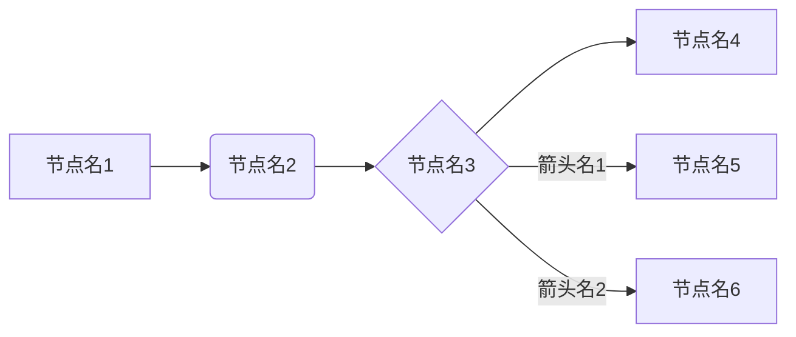

# 总结绘制脑图

## Instructions
The following text is the prefix that will be added to the user input:

```text
"""


```

The following text is the suffix that will be added to the user input:

```text


"""

使用mermaid flowchart对以上文本进行总结，概括上述段落的内容以及内在逻辑关系，例如：

以下是对以上文本的总结，以mermaid flowchart的形式展示：


注意：
（1）使用中文
（2）节点名字使用引号包裹，如["Laptop"]
（3）`|` 和 `"`之间不要存在空格
（4）根据情况选择flowchart LR（从左到右）或者flowchart TD（从上到下）

```

## Usage
Provide the input text that needs to be processed.
